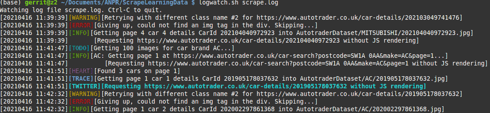

# logwatch

## Yet Another Logfile Viewer (YALV), but in full technicolour!



Highlight keywords in log files in various colours, that are typically used in Log4-configurations (Log4Java, Log4Python, Log4Perl, etc..). The keywords are ERROR, INFO, WARNING, DEBUG, TRACE, SECURITY, FATAL, TODO, TWITTER, and can easily be changed in the script.

## Usage:

`logwatch.sh my_app_logfile.log`

## Installation:

Manually copy `logfile.sh` to `/usr/local/bin`

Optionally create a symlink so that you can just type "logwatch".

`cd /usr/local/bin`

`ln -s logwatch.sh logwatch`

## Setting up Log4Python in your Python Proiject

# Set up logging

This will set up basic logging to a log file calle [your_appname].log

You can use the logging functions `logger.critical()`, `logger.error()`, `logger.info()`, `logger.debug()`.

```import logging
logger = logging.getLogger(__name__) 
logger.setLevel(logging.DEBUG)
formatter = logging.Formatter('[%(asctime)s][%(levelname)s][%(message)s]',datefmt='%Y%m%d %H:%M:%S')
file_handler=logging.FileHandler(__file__.replace('.py','.log'))
file_handler.setFormatter(formatter)
file_handler.setLevel(logging.DEBUG)     # <-- write logger entries down to DEBUG level to file
stream_handler=logging.StreamHandler()
stream_handler.setFormatter(formatter)
stream_handler.setLevel(logging.WARNING)   # <-- write logger entries down to WARNING level to display
logger.addHandler(stream_handler)
logger.addHandler(file_handler)
```

You can add your own custom logging levels, such as one for TIMEOUT error:

```logging.TIMEOUT = 45    #  <-- just above ERROR level
logging.addLevelName(logging.TIMEOUT, "TIMEOUT")
def timeout(self, message, *args, **kws):    
    self._log(logging.TIMEOUT, message, args, **kws) 
logging.Logger.timeout = timeout
```

... and then start using the new function, `logger.timeout()`
